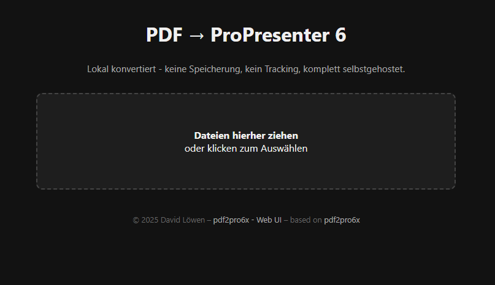

# pdf2pro6x-web-ui
Convert PDF files to ProPresenter 6 `.pro6x` bundles – now with a drag-and-drop Web UI.

A web-based frontend for [P1zz4br0etch3n/pdf2pro6x](https://github.com/P1zz4br0etch3n/pdf2pro6x) using Flask and HTML5.

## Features
- Drag & Drop PDF upload
- Live progress bar with animated feedback
- Visual feedback for success and styled error messages
- Multi-file upload with individual or bulk download
- Fully local processing, no cloud involved

## Screenshot


## Requirements
Make sure `poppler-utils` is installed (for `pdf2image`).
- [Windows instructions](https://stackoverflow.com/a/60659237/7523613)
- [macOS](https://formulae.brew.sh/formula/poppler)

## Setup
```bash
# Clone the repo
git clone https://github.com/hidebook/pdf2pro6x-web-ui.git
cd pdf2pro6x-web-ui/web

# Create and activate a virtual environment (optional)
python3 -m venv venv
source venv/bin/activate

# Install Python dependencies
pip install -r requirements.txt

# Run the web interface
python app.py
```

Then visit [http://localhost:8808](http://localhost:8808) in your browser.

## File structure
```
pdf2pro6x-web-ui/
├── pdf2pro6x.py            # original CLI converter
├── web/
│   ├── app.py              # Flask app
│   ├── converter.py        # handles conversion
│   └── templates/index.html  # web UI
```

## Notes
- Designed for local/offline use (LAN support)
- Compatible with Linux, macOS, Raspberry Pi

## License & Credits
Based on [P1zz4br0etch3n/pdf2pro6x](https://github.com/P1zz4br0etch3n/pdf2pro6x)

© 2025 by [hidebook](https://github.com/hidebook)